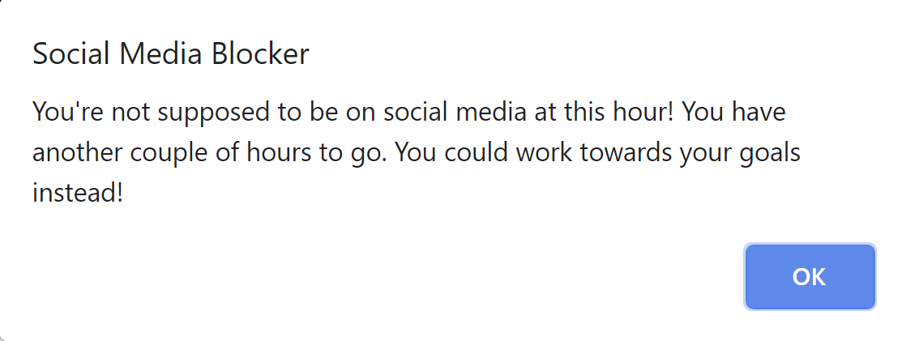

# social-media-blocker
A Chrome extension that prevents me from browsing social media websites during work hours (7am - 7pm). It also prevents me from checking my emails too often so I can stay focused on task.

When browsing restricted websites such as Facebook or Instagram, it will show a popup, which will redirect to my Trello board to focus on the goals that I've set for myself for the week. 

